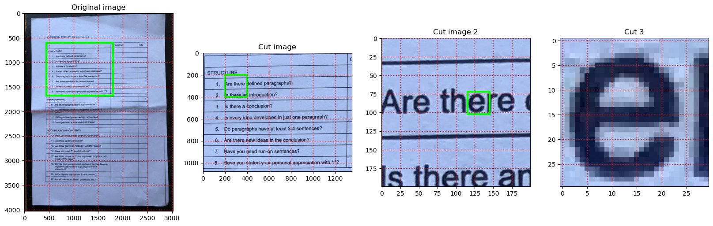
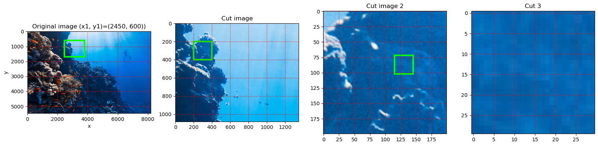

# Computer Vision Notebooks

This repository contains a collection of Computer Vision basics Jupyter notebooks.

Libraries used:
1. OpenCV
2. PyTesseraact
3. Matplotlib and SeaBorn
4. Numpy

 

## Table of Contents

1. [Image Plotting](notebooks/image-plotting.ipynb)
<!-- 1. [Image Basics](notebooks/image-basics.ipynb) -->
<!-- 3. [Image Processing](notebooks/image-processing.ipynb) -->

 

---
 

### Image Plotting

This notebook contains examples of how to plot images using Matplotlib.

Example (text with lines): 

Example (unsaplash sea):
