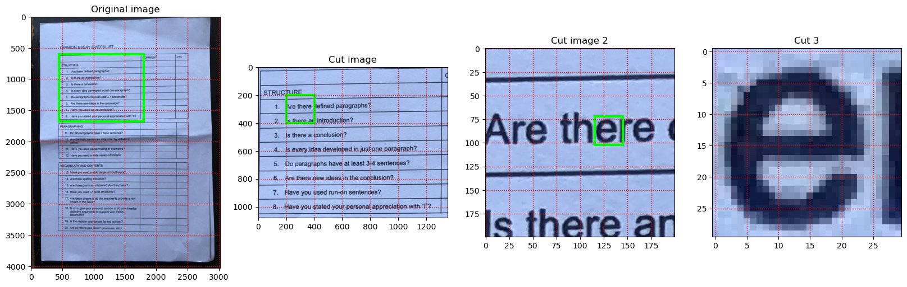

# Computer Vision Notebooks

This repository contains a collection of Computer Vision basics Jupyter notebooks. I have created while learning about computer vision. The notebooks are written in Python and use the OpenCV library. The notebooks are intended to be used as a learning resource for myself and others.

Libraries used:
1. OpenCV
2. PyTesseraact
3. Matplotlib and SeaBorn
4. Numpy

## Table of Contents

1. [Image Basics](notebooks/image-basics.ipynb)
2. [Image Plotting](notebooks/image-plotting.ipynb)
3. [Image Processing](notebooks/image-processing.ipynb)

### Image Plotting

This notebook contains examples of how to plot images using Matplotlib.

<!-- Insert markdown image -->
